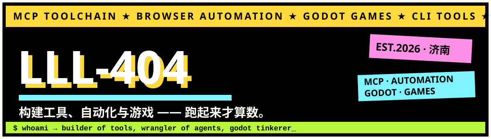

# 你好，我是 LLL-404 👋

> **构建工具、自动化与游戏 —— 跑起来才算数。**

- 🔧 写 **MCP 工具**：让 AI 助手操作 Word 文档、安卓设备与浏览器
- 🤖 做**浏览器自动化 Agent** 和各种省事的小工具
- 🎮 用 **Godot + C#** 捯饬 RTS 攻防肉鸽与小游戏原型
- 🌍 个人站：**[lll-404.github.io/personal-homepage](https://lll-404.github.io/personal-homepage/)**

 

## 🗂 精选仓库

 

💾 存档仓库（私有）：**warden** · Godot RTS 攻防肉鸽 ｜ **tapline** · 60-90 秒反应小游戏 ｜ **novel** · 网文创作工程
